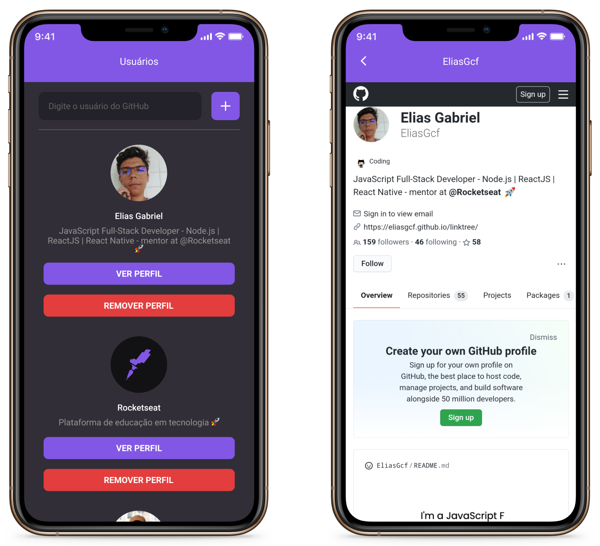

<h1 align="center">
  GitHub Favorites
</h1>

<h3 align="center">
  Save your favorites GitHub users
</h3>

<p align="center">
  <a href="https://www.linkedin.com/in/eliasgcf/" target="_blank" rel="noopener noreferrer"></a>
  
  <a href="https://github.com/EliasGcf/github-favorites/commits/master"></a>
  <a href="https://github.com/EliasGcf/github-favorites/issues"></a>
  
</p>

<p align="center">
  <a href="#-about-the-project">About the project</a>&nbsp;&nbsp;&nbsp;|&nbsp;&nbsp;&nbsp;
  <a href="#-technologies">Technologies</a>&nbsp;&nbsp;&nbsp;|&nbsp;&nbsp;&nbsp;
  <a href="#-getting-started">Getting started</a>&nbsp;&nbsp;&nbsp;|&nbsp;&nbsp;&nbsp;
  <a href="#-how-to-contribute">How to contribute</a>&nbsp;&nbsp;&nbsp;|&nbsp;&nbsp;&nbsp;
  <a href="#-license">License</a>
</p>

<p align="center">
  
</p>

## 🧑🏻‍💻 About the project

This is simple mobile app to save and list your favorites GitHub Users, using GitHub REST API.

I use [CRNA](https://github.com/expo/create-react-native-app) to start this project.

[Click here](https://www.figma.com/file/qCBy1sj7sL03Ihh3Wym0NV/GitHub-Favorites-App?node-id=0%3A1) to access the app layout on Figma.

## 🚀 Technologies

Technologies that I used to develop this mobile client

- [ReactJS](https://reactjs.org/)
- [React Native Unimodules](https://github.com/unimodules/react-native-unimodules)
- [TypeScript](https://www.typescriptlang.org/)
- [React Native](https://reactnative.dev/)
- [React Navigation](https://reactnavigation.org/)
- [UnForm](https://unform.dev/) [💜](https://rocketseat.com.br/)
- [Styled Components](https://styled-components.com/)
- [Axios](https://github.com/axios/axios)
- [Eslint](https://eslint.org/)
- [Prettier](https://prettier.io/)
- [EditorConfig](https://editorconfig.org/)

## 💻 Getting started

### Requirements

- You must have React Navite development environment
- [Yarn](https://classic.yarnpkg.com/lang/en/) or [npm](https://docs.npmjs.com/cli/npm)

**Clone the project and access the folder**

```bash
$ git clone https://github.com/EliasGcf/github-favorites.git && cd github-favorites
```

**Follow the steps below**

```bash
# Install the dependencies
$ yarn

# If you are going to emulate with android, run this command
# Be sure to have the emulator open
$ yarn android

# If you are going to emulate with ios, run this command
$ yarn ios
```

## 🤔 How to contribute

**Make a fork of this repository**

```bash
# Fork using GitHub official command line
# If you don't have the GitHub CLI, use the web site to do that.

$ gh repo fork EliasGcf/github-favorites
```

**Follow the steps below**

```bash
# Clone your fork
$ git clone your-fork-url && cd github-favorites

# Create a branch with your feature
$ git checkout -b my-feature

# Make the commit with your changes
$ git commit -m 'feat: My new feature'

# Send the code to your remote branch
$ git push origin my-feature
```

After your pull request is merged, you can delete your branch

## 📝 License

This project is licensed under the MIT License - see the [LICENSE](LICENSE) file for details.

---

Made with 💜 &nbsp;by Elias Gabriel 👋 &nbsp;[See my linkedin](https://www.linkedin.com/in/eliasgcf/)
